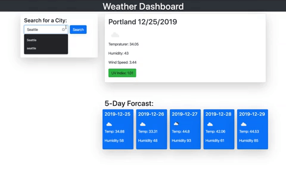

# weather-dashboard


## Summary 

This applicaiton is a weather dashboard with search functionality to find current weather conditions and the future weather outlook for multiple cities. This application utilizes the AJAX to hook into OpenWeather API to retrieve data in JSON format. Using dynamically updated HTML and CSS powered by jQuery we can show the user the follwoing information:
Displayed the following under current weather conditions:
- City
- Date
- Icon image (visual representation of weather conditions)
- Temperature
- Humidity
- Wind speed
- UV index
Include a 5-Day Forecast below the current weather conditions. Each day for the 5-Day Forecast should display the following:
- Date
- Icon image (visual representation of weather conditions)
- Temperature
- Humidity

It also Includes a search history so that users can access their past search terms. Clicking on the city name that populates under the search bar after their initial search, will perform a new search that returns current and future conditions for 

## Site Demo


 
## Technologies Used
- jQuery - Used for event listeners of parent and childeren elements as well as to store and recall those varible in local      storage to be displayed dynamically in HTML on the page.
- momentjs - Used to pull current date for the current city.
- javascript - Used to dynamically change html and store user-input.
- Bootstrap - Used to pull existing html and CSS for creating resposive organizational structer and styling for the site.
- HTML - Used to create elements on the DOM
- CSS - Styles html elements on page
- Git - Version control system to track changes to source code
- GitHub - Hosts repository that can be deployed to GitHub Pages
 


## Code Snippet
Pulling from the Openweather API listed bellow are the two calls within the city search function. These two calls are run when our onclick is triggered in our event listener. Onced this function is told to run it pulls the necessary information from the object retreived from the queryURL and we parse out the information we need into new varible elements we create. Taking these new elemetns we then append them into a new div that gets inserted into the HTML tag that we cleared at the begining of our function.

```js

function searchCity(cityname) {

    var queryURL = "https://api.openweathermap.org/data/2.5/weather?q=" + cityname + "&units=imperial&appid=ecc0be5fd92206da3aa90cc41c13ca56";
    var queryURLforcast = "https://api.openweathermap.org/data/2.5/forecast?q=" + cityname + "&units=imperial&appid=ecc0be5fd92206da3aa90cc41c13ca56";

    $.ajax({
        url: queryURL,
        method: 'GET'
    }).then(function (response) {
        console.log(response);
        console.log(queryURL);
        //empty divs and ids that we need to dump content into.....
        $("#current").empty();
       var mainDate = moment().format('L');
 

        //create HTML for city information......
        var cityNameEl = $("<h2>").text(response.name);
        var displayMainDate = cityNameEl.append(" " + mainDate);
        var tempEL = $("<p>").text("Tempraturer: " + response.main.temp);
        var humEl = $("<p>").text("Humidity: " + response.main.humidity);
        var windEl = $("<p>").text("Wind Speed: " + response.wind.speed);
        var currentweather = response.weather[0].main;
        //conditional statments for weather icons............................................
        if (currentweather === "Rain") {
            var currentIcon = $('').attr("src", "http://openweathermap.org/img/wn/09d.png");
            currentIcon.attr("style", "height: 60px; width: 60px");
        } else if (currentweather=== "Clouds") {
            var currentIcon = $('').attr("src", "http://openweathermap.org/img/wn/03d.png");
            currentIcon.attr("style", "height: 60px; width: 60px");
        } else if (currentweather === "Clear") {
            var currentIcon = $('').attr("src", "http://openweathermap.org/img/wn/01d.png");
            currentIcon.attr("style", "height: 60px; width: 60px");
        }
         else if (currentweather === "Drizzle") {
            var currentIcon = $('').attr("src", "http://openweathermap.org/img/wn/10d.png");
            currentIcon.attr("style", "height: 60px; width: 60px");
        }
         else if (currentweather === "Snow") {
            var currentIcon = $('').attr("src", "http://openweathermap.org/img/wn/13d.png");
            currentIcon.attr("style", "height: 60px; width: 60px");
        }
        //create HTML div to append new elements to render on page....
        var newDiv = $('<div>');

        newDiv.append(displayMainDate, currentIcon, tempEL, humEl, windEl);

        $("#current").html(newDiv);
//---------------------------------------------UV index call ---------------------------------------//

var lat = response.coord.lat;
var lon = response.coord.lon;
var queryURLUV = "https://api.openweathermap.org/data/2.5/uvi?&appid=ecc0be5fd92206da3aa90cc41c13ca56&lat=" + lat  + "&lon=" + lon;
        //New call for the UV index information........................
        $.ajax({
            url: queryURLUV,
            method: 'GET'
        }).then(function (response) {
            $('#uvl-display').empty();
            var uvlresults = response.value;
            //create HTML for new div
            var uvlEl = $("<button class='btn bg-danger'>").text("UV Index: " + response.value);
            //insert new UV element containing the index infromation from current forcast to corresponding id....
            $('#uvl-display').html(uvlEl);
    
        });
    });

```


## Built With

* [API](https://openweathermap.org/api)
* [jQuery](https://api.jquery.com/)
* [HTML](https://developer.mozilla.org/en-US/docs/Web/HTML)
* [CSS](https://developer.mozilla.org/en-US/docs/Web/CSS)
* [Boostrap](https://getbootstrap.com/)

## Authors

**Chris Melby** 

- [Link to Portfolio Site](#)
- [Link to Github](https://github.com/cmelby)
- [Link to LinkedIn](https://www.linkedin.com/in/chris-melby-71106b126/)